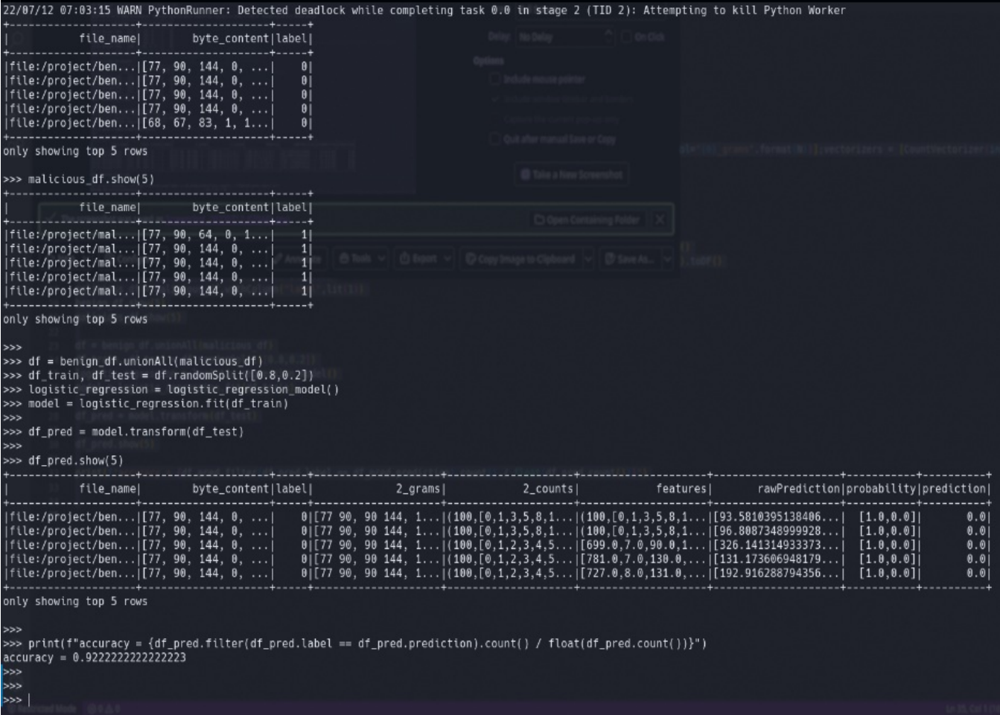

# Detecting Malware with Spark ML

This project is a machine learning model that can detect whether an executable file is malicious or benign. Here used a logistic regression algorithm to train the model on a dataset of known malicious and benign files. The model is then used to predict the labels of new, unknown files.

## Problem

Malware is a serious threat to computer security. It can damage files, steal data, and even take control of a computer. It's important to be able to detect malware in order to protect our computers from attack.

## How it works

The system workflow is pretty simple:

1. Load the malicious and benign files into Spark DataFrames.
2. Extract 500 bytes from each file and store them in a new column called `byte_content`.
3. Combine the malicious and benign DataFrames into a single DataFrame.
4. Label the malicious files as 1 and the benign files as 0.
5. Split the DataFrame into training and test sets.
6. Train a logistic regression model on the training set.
7. Use the model to predict the labels of the test set.

## Results

The logistic regression model achieved an accuracy of 92.2% on the test set.

## Future work

There are a few things that yet to be improved in this project:

* Train the model on a larger dataset of malicious and benign files.
* Improve the accuracy of the model by using a different machine learning algorithm.
